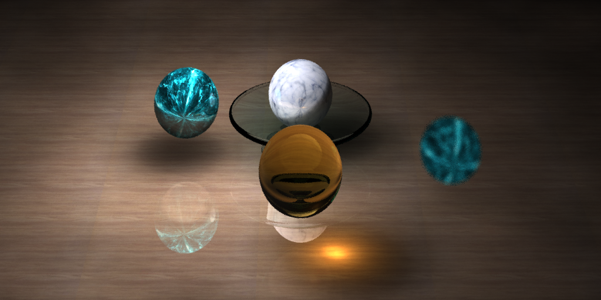
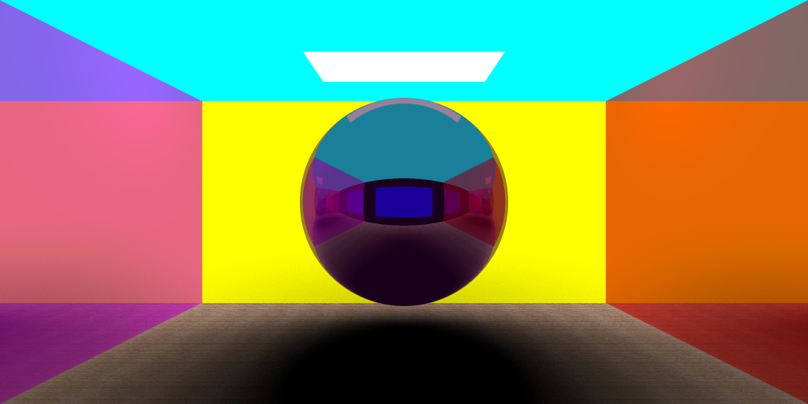
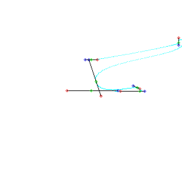

# 图形学大作业实验报告

计62 毛晗扬 2016011275

# 结果图

*注：可能存在一点误解，橙色求折射的是曲面物体的底座而非顶部，因此没有球的像。

# 工程介绍

##	 编译命令	

`cmake -DCMAKE_CXX_COMPILER=/usr/local/bin/clang-omp++ 
 -DCMAKE_C_COMPILER=/usr/local/bin/clang-omp ..`
 
 *`/usr/local/bin/clang-omp `是一个支持`-fopenmp`的g++编译器

## 文件目录

./core 核心结构，如颜色类，向量类，物体基类等
./objects 自定义物体
./render 自定义渲染算法
./display 实时渲染进度输出
./materials 贴图材质目录
./result 所有结果目录

# 得分点

* 光线追踪算法（RayTracing）[render/raytracing.cpp]
* 基于路径hash的抗锯齿算法[render/raytracing.cpp:123]
* 渐进式光子映射算法（ProgressivePhotonMapping）[render/progressive\_photon\_mapping.cpp]
* OpenMP性能加速[render/progressive\_photon\_mapping.cpp:57]
* 包围盒加速[objects/bazier_curve.cpp:36]
* KD树加速[render/progressive\_photon\_mapping.cpp:78]
* 分段贝塞尔曲线[objects/bazier_curve.cpp]
* 物体贴图[core/texture.cpp]
* 景深[core/camera.cpp:23]

## 性能加速

在程序中使用了openmp加速，如并行多行渲染：

## 算法加速

### 包围盒

在贝塞尔曲线求交期间，通过圆柱体包围盒，优先判断光线是否与包围盒有交点。

### KD树

在光线追踪部分，我使用KD树寻找距离小于R的碰撞点。KD树本身使用基于轮换分割维度建树的方式。

## 光线追踪

普通的光线追踪算法支持反射折射等基本情形。

通过路径hash可以有效减少边缘锯齿效应。

## 贝塞尔曲线求交

由于本身希望做一个类似于沙漏、水杯这类东西，这是一个一维贝塞尔曲线绕指定轴旋转而成的，我们需要得到光线与曲面的交点信息。

四维贝塞尔曲线$P(u)$通过4个控制点定义，坐落于2维平面上

$$
P(u) = \left[ \matrix{P_x(u) \\ P_y(u)} \right] = 
\left[ 
	\matrix{
		\sum _{i=0}^n P_i^{(x)} (1-u)^{n-i}u^i \\
		\sum _{i=0}^n P_i^{(y)} (1-u)^{n-i}u^i
	}
 \right]
$$

$$
\frac{dP}{du} = n \sum_{i=0}^{n-1} P_i (B_{i-1,n-1}(u) - B_{i,n-2}(u))
$$

设光线为$C(t)$，曲面为$S(u,\theta)$

$$
C(t) = \left[ 
	\matrix{
		O_x + t D_x \\
		O_y + t D_y \\
		O_z + t D_z \\
		}
\right]
$$

$$
S(u,\theta) = \left[
	\matrix{
		Q_x + sin\theta P_x(u) \\
		Q_y + cos\theta P_x(u) \\
		Q_z + P_y(u)
	}
\right]
$$

分别对于$C(t)$,$S(u,\theta)$求导

$$
\frac{dC}{dt} = \left[ \matrix{D_x \\ D_y \\ D_z}\right]
$$

$$
\frac{\partial S}{\partial u} = \left[ 
	\matrix{
		sin\theta \frac{d{P_x}}{d{u}} \\
		cos\theta \frac{d{P_x}}{d{u}} \\
		\frac{\partial{P_y}}{\partial{u}}
	}
	\right]
$$
$$
\frac{\partial S}{\partial \theta} = \left[ 
	\matrix{
		cos\theta P_x(u) \\
		-sin\theta P_x(u) \\
		0
	}
	\right]
$$

最小化$F(u,\theta,t) = C(t) - S(u,\theta)$

显然
$$
\frac{\partial F}{\partial t} =  \left[ 
\matrix{
\frac{\partial F_1}{\partial t} & \frac{\partial F_1}{\partial u} & \frac{\partial F_1}{\partial \theta} \\
\frac{\partial F_2}{\partial t} & \frac{\partial F_2}{\partial u} & \frac{\partial F_2}{\partial \theta} \\
\frac{\partial F_3}{\partial t} & \frac{\partial F_3}{\partial u} & \frac{\partial F_3}{\partial \theta} \\
} \right] 
$$

$$
\frac{\partial F}{\partial t} = \left[
\matrix{
	D_x & sin\theta \frac{dP_x}{du} & cos\theta P_x(u)\\
	D_y & cos\theta \frac{dP_x}{du} & -sin\theta P_x(u)\\
	D_z & \frac{dP_y}{du} & 0\\
}
\right]
$$
其中

$$
\frac{dP}{du} = n \sum_{i=0}^{n-1} P_i (B_{i-1,n-1}(u) - B_{i,n-2}(u))
$$

将通过牛顿迭代，我们可以计算出F函数的零点，其中有两点需要注意的地方

* 牛顿迭代需要保证答案中$u \in [0,1]$，而牛顿迭代本身无法附加条件，因此需要在答案的邻域中查找合适的$u$,$t$,$\theta$，我用到的方法是，对于给定曲线，生成一个圆柱体包含框，随机该圆柱体里面高度$h$的一个圆形面片，将光线与该面片的交点的$u$,$t$,$\theta$作为迭代的初值。随机$h$约30次即可得解。

* 由于牛顿迭代不太精确，可能是的结果产生微小偏移，这种偏移会对判断点在平面哪一侧产生影响，我们可以通过调整eps的取值，不同部分赋予不同的eps，使得这些误差不至于相互影响。

曲线控制点为

## 纹理贴图

所有贴图可以在./materials里面找到。

## 景深

在场景中设置了一个对焦错误的球体供参考，核心思路为修改相机类，使得非聚焦位置的物体接收到的光线有较大的随机误差偏移，进而产生景深的模糊效果。
